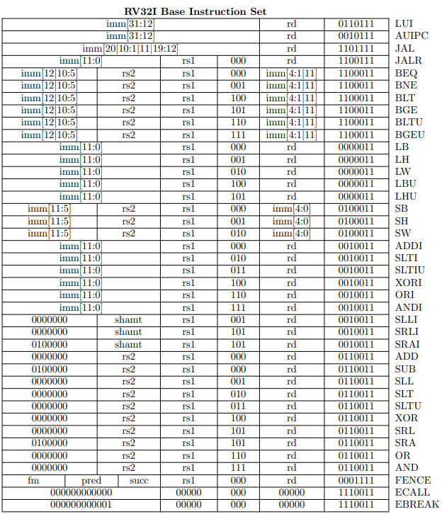

# Required
```
iverilog
gtkwave
```
`iverilog` is used to compile verilog progrom and `gtkwave` is for visualize the signal. And your mechine maybe need to be little indian(I'm not sure).

> `iveriog` 是用來編譯 verilog 語言的，而`gtkwave` 是用來將模擬的訊號視覺化的工具。且你的機器應該要是little indian格式的(我不確定)

# Usage

## for simulate (Linux)
You can write your RISC-V instruction, which include in RV32IMA, in `sim/rom.S` file. After completed your code. run `make` command in the root path of this repository, it will compile all file that need compile. After all compilation is done. you can go to `sim/` forder and simplily run `./simulation.sh`. It will pop up the `gtkwave` interface and the signal will in visualize in it. Also, you can see the registers status at your CLI at the time they changed.

> 你可以將想要執行的 rv32ima 指令寫在 `sim/rom.S` 檔案中。接著在這個repository底下執行 `make`。這會將所有需要編譯和需要的檔案都整理好放到 `sim/` 資料夾底下。接著，移動工作路徑到`sim/` 資料夾內，並且執行 `simulation.sh`。就會自動啟動 `gtkwave`。同時，在指令視窗中可以看到每次 register 的變化。


# Instruction (rv32ima)

## RV32I Base Instruction Set
